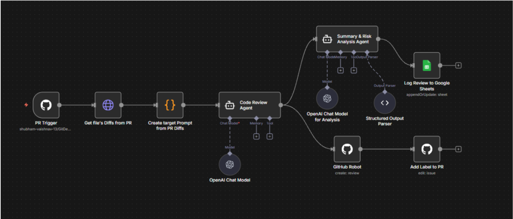

# AgenticPR


A Pull Request Intelligence System frontend built with React and Vite.

## Getting Started

Follow these steps to set up and run the project locally.

### Prerequisites

- Node.js (Latest LTS version recommended)

### Installation

1. Navigate to the project directory:
   ```bash
   cd AgenticPR
   ```
2. Install dependencies:
   ```bash
   npm install
   ```

### Running the App

Start the development server:

```bash
npm run dev
```

The application will be available at `http://localhost:5173` (or the port shown in your terminal).

## Scripts

- `npm run dev`: Starts the development server.
- `npm run build`: Builds the app for production.
- `npm run preview`: Previews the production build locally.
- `npm run lint`: Runs ESLint to check for code quality issues.

## Tech Stack

- **Framework**: React
- **Build Tool**: Vite
- **Styling**: Tailwind CSS


## History

- LAB 1 : 8 Dec 2025 : Added Basic Project setup + Added frontend sections

- LAB 2 : 15 Dec 2025 : Added basic workflow in n8n and github api's to fetch PR data and diffs

- Lab 3 : 22 Dec 2025 : Added Github Official MCP and tried various function call with differnt LLM's 

